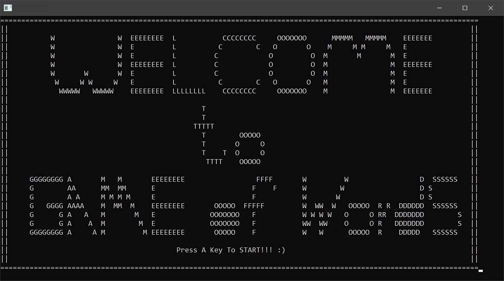
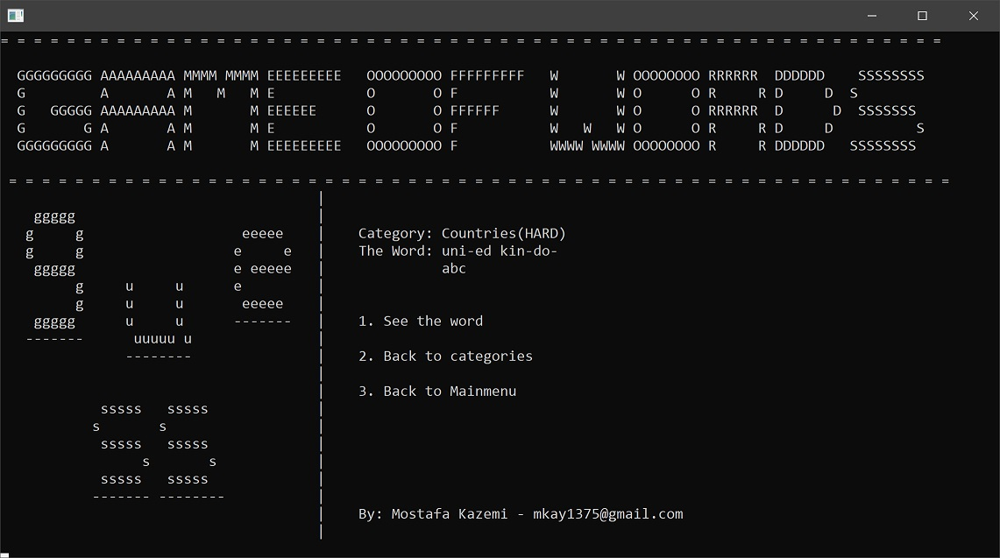

# Game of Words

A very simple game which you should guess the word with trying characters.

This exercise project was one of my first projects (written in C) in 
the first semester of university for basic programming
course.

You can download the executable from the releases.

_This project, as I mentioned, was written in C language
and was compiled with [Dev-C++](https://github.com/Embarcadero/Dev-Cpp);
because of some issues with its C compiler and/or my very basic knowledge,
code file extensions were cpp and therefore they were compiled with C++
compiler._

## Screenshots

